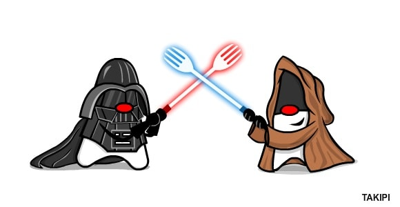

# The Forks Awakens
 

## Ejercicio Integrador

**Hace mucho tiempo, en una cursada muy muy lejana, antiguos programadores tuvieron la tarea de hacer un sistema para modelar la guerra que se avecinaba, pero su tarea quedó inconclusa. Sabemos que pronto la fuerza volverá a despertar y tenemos que estar listos para esto, por lo que necesitamos un sistema para recordar los sucesos y los protagonistas de esa antigua guerra.**

_“El miedo es el camino hacia el Lado Oscuro: el miedo lleva a la ira, la ira lleva al odio, el odio lleva al sufrimiento.”_

Revisando antiguos pergaminos encontramos información sobre los más variados seres que se distribuían en los innumerables planetas del universo.

### Planetas y sus habitantes
Cuando un planeta entra en guerra, si bien hay soldados entrenados para combatir, todos sus habitantes deben estar preparados y ser capaces de desplegar todo su poder. El poder de cualquier habitante de un planeta se calcula como su propia valentía más su inteligencia. En el caso de los soldados (como los stormtrooper, droides, clones y en general todos los personajes que combaten), se le suma la potencia de las armas y otros elementos que conforman su equipamiento (pistolas, granadas, guantes, etc) y que se considere útiles (cuando tiene potencia superior a 10 y no se encuentran desgastadas por el uso).  

### Maestros
Además, en los planetas también hay otros personajes que son conocidos como maestros, que poseen una gran concentración de midiclorianos en su cuerpo. Ellos tienen control sobre la Fuerza, la cual es tan poderosa como peligrosa, y pueden utilizarla de diferentes maneras: A quienes siguen el lado luminoso de la Fuerza y la usan para el bien del universo se les llama Jedi, mientras que se conoce como Sith a los que siguen su lado oscuro, utilizándola para causar daño o buscar inescrupulosamente su beneficio personal. Todo maestro tiene un sable de luz que sabe manejar con destreza y precisión.

**Jedi:** Los Jedi son honorables caballeros con gran disciplina y sabiduría. Su poder es calculado como su valentía más su inteligencia, a lo que se le suma la milésima parte de la cantidad de midiclorianos en su cuerpo y la potencia que le otorga su sable de luz, que es equivalente a la energía misma del sable por el tiempo que el maestro Jedi lleva en el lado de la luz.

**Sith:** Los Sith, corrompidos por la codicia y la ira, solo buscan el poder y no importa cuales sean los medios necesarios para llegar a su objetivo, lo harán despiadadamente. Su poder es similar al de un Jedi, con la diferencia que la potencia de su sable de luz se calcula como el doble de la energía propia del sable, más el tiempo que lleva siendo Sith. 

### Sucesos importantes
Como cualquiera de nosotros, los maestros se desarrollan en la sociedad y pasan por diferentes situaciones que los hacen replantearse su vida. Los sucesos importantes, especialmente los que tienen una gran carga emocional, pueden alterar la forma en la cada uno ve el mundo y así cambiar el camino de la fuerza que siguen. La carga emocional que provoca un suceso se representa con un número que puede ser positivo o negativo. Cada suceso que un maestro vive implica el paso del tiempo en una unidad.

Un maestro Jedi empieza con una paz interior alta y cada suceso importante que vive la aumenta o disminuye, según su carga emocional. Si como consecuencia de un suceso la paz interior del Jedi se anulase por completo, su corazón se vería perturbado por el miedo, la ira y el odio y su sufrimiento sería tan grande que su única salida consiste en convertirse en un Maestro Sith, con un elevado nivel de odio inicial.

Los maestros Sith van acumulando odio interno con los sucesos que van viviendo. Sin importar la carga emocional de cada uno, su odio aumenta un 10% en cada suceso importante que vive, excepto que el suceso tenga una carga emocional muy grande (mayor a su odio) en cuyo caso la coraza de su corazón se rompe y puede ver el camino de destrucción que ha dejado y que le espera, arrepintiéndose de sus actos, convirtiéndose en un Jedi y de esta manera pasar al camino de la luz.

Cuando un maestro cambia de lado, todo su equipamiento se repara.

### Requerimientos:
Desarrollar los métodos que permitan:
- Calcular el poder de un planeta, que es la suma del poder de todos los que lo habitan. 
- Permitir que los solados tomen y se desprendan de armas y otros elementos. Que al usarlas se desgasten pero que luego se puedan reparar.
- Saber si un planeta posee una orden, lo cual sucede si con solo los 3 habitantes más poderosos (probablemente maestros) logra obtener mayor poder que la mitad del poder del planeta.
- Representar qué le sucede a un maestro al vivir cualquier suceso importante. 

### Pruebas 
Hacer tests de los principales items, entre ellas probar las siguientes situaciones (**¡Spoiler Alert!**):

- **Halcón:** Han y Chubby tienen el "Halcón Milenario" y con el uso de desgastó. Luego, Ray lo toma y arregla.
- **Tatooine:** Un planeta con más de tres habitantes que posse una orden. 
- **La Fuerza:** Como honorable maestro de la Orden Jedi, Anakin sigue el camino de la luz, sin embargo un doloroso suceso de alta carga emocional negativa hacen que la ira y el odio lo dominen y su sufrimiento lo hace convertirse en uno de los maestros Sith más poderosos y temidos de la historia, Darth Vader. Más adelante, luego de imponer un imperio del terror y dominar gran parte de la galaxia, se encuentra en una situación extrema en la cual Lord Palpatine intenta convencerlo de que asesine a su hijo Luke, este suceso tiene una carga emocional tan grande para él que termina arrepintiéndose de sus actos y volviendo al lado de la luz.

_“Corrompido por el lado oscuro, el joven Skywalker ha sido. 
el muchacho que adiestraste desaparecido ha… consumido, por Darth Vader”_

